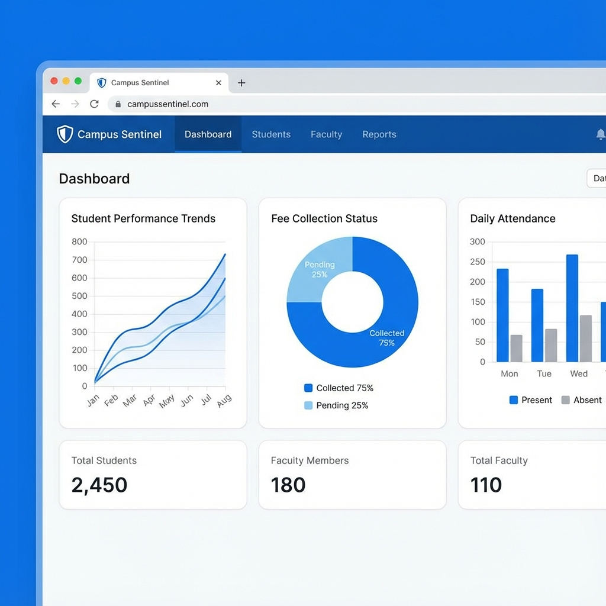

# Campus Sentinel 🛡️

### The World’s First AI-Powered School ERP System

[](https://nextjs.org/)
[](https://react.dev/)
[](https://tailwindcss.com/)
[](LICENSE)

**Campus Sentinel** is a revolutionary AI-driven educational management platform designed to transform how schools operate, monitor, and communicate. By embedding artificial intelligence at the core of campus operations, we enable schools to save time, enhance safety, and deliver superior outcomes for students, teachers, and parents.



---

## 🚀 Key AI-Powered Features

Campus Sentinel goes beyond traditional ERP software by introducing intelligent automation to eliminate manual workflows.

### 📹 Automatic Attendance Through Surveillance

Eliminate roll calls and proxy attendance. Our AI-enabled cameras capture attendance automatically as students enter the campus, ensuring 100% accuracy and saving 20+ minutes of teaching time daily.

### 🛡️ AI-Based Campus Surveillance

Real-time monitoring to enhance campus safety. The system detects anomalies, maintains discipline, and alerts administrators to unauthorized entries or emergencies instantly.

### 📱 Automated Parent Communication

Keep parents engaged with AI-driven updates. From attendance alerts to academic milestones and emergency announcements, Campus Sentinel handles communication via automated messages and calls.

### 💰 Smart Fee Reminders

Improve fee collection efficiency with AI-driven follow-ups. The system identifies pending fees and sends personalized, timely reminders to parents, reducing administrative burden.

### 📝 Automatic Answer Sheet Evaluation

Accelerate the grading process with AI-assisted evaluation. Ensure faster, consistent, and unbiased assessments for objective and semi-structured answer sheets.

### 📊 AI-Based Student Evaluation

Gain deeper insights into student performance. We analyze academic data, attendance trends, and behavioral patterns to provide personalized development plans for every student.

---

## 🛠️ Complete School ERP Platform

Beyond AI, Campus Sentinel provides a robust, unified platform for all administrative needs:

- **Student & Teacher Management:** Comprehensive profiles and lifecycle tracking.
- **Attendance & Timetable:** Dynamic scheduling and automatic tracking.
- **Fee & Finance Management:** Secure payment gateways and transparent reporting.
- **Exams & Results:** Digital gradebooks, report card generation, and analytics.
- **Communication Hub:** Unified portal for parent-teacher-student interaction.
- **Dashboards:** Data-rich administrative view for real-time decision making.

---

## 🌟 Our Vision

> "To create intelligent, secure, and data-driven school campuses where administrators focus on growth, teachers focus on teaching, and students focus on learning—while AI handles the rest."

---

## 🏗️ Built for Growth

Designed specifically for the realities of **Indian Schools** while maintaining global standards:

- **Scalable:** Grow from a single branch to a multi-city chain effortlessly.
- **Affordable:** Premium AI features without the enterprise price tag.
- **Reliable:** High-performance architecture ensuring 99.9% uptime.


---

## 💻 Tech Stack

- **Frontend:** Next.js (App Router), React 19
- **Styling:** Tailwind CSS, Radix UI (Shadcn)
- **State Management:** React Hook Form, Zod
- **Data Visualization:** Recharts
- **Animations:** Tailwind Animate, Framer Motion (implied)

---

## 🚦 Getting Started

To run Campus Sentinel locally, please follow these steps:

1. Clone the repository.
2. Install dependencies:
   ```bash
   pnpm install
   ```
3. Run the development server:
   ```bash
   pnpm dev
   ```

For detailed setup instructions, please refer to [RUNNING_INSTRUCTIONS.md](./RUNNING_INSTRUCTIONS.md).

---

## 📜 License

© 2026 Campus Sentinel. All rights reserved. Built for modern schools, ready for the world.

---

### SEO Metadata (Internal Use)

- **Primary Keywords:** School ERP, AI School Management, Automated Attendance System, Campus Surveillance, AI Education India.
- **Description:** Campus Sentinel is the world's first AI-powered School ERP system, automating attendance, grading, and communication for modern educational institutions.
